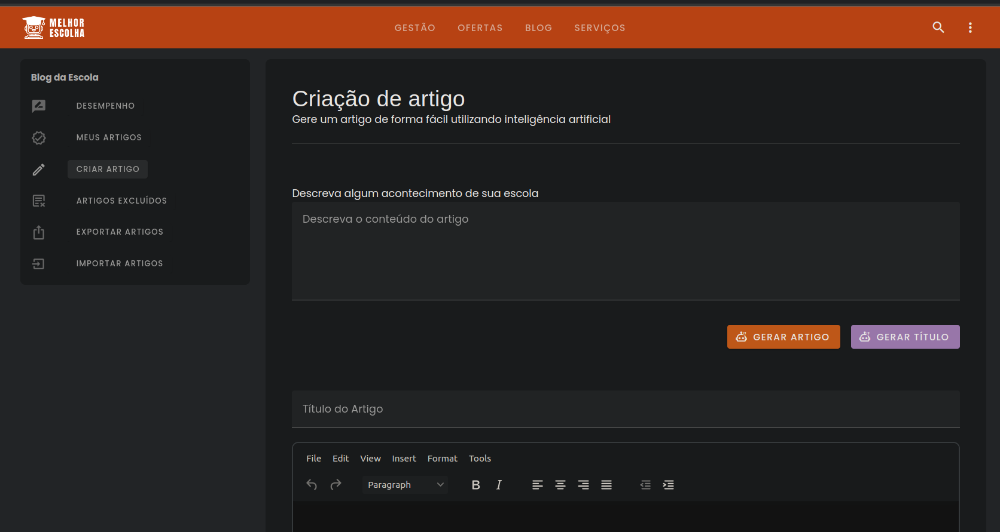

<br/>
<br/>

<p align="center">
  <a href="https://vuejs.org/">
    
  </a>
  
  <a href="https://vitejs.dev/">
    
  </a>
  
  <a href="https://pinia.vuejs.org/">
    
  </a>
  
  <a href="https://zilla.pages.dev/?path=/story/docs-getting-started-engineering-quick-start--page">
    
  </a>
  
  <a href="https://vitest.dev/">
  
  </a>
  
  <a href="https://www.typescriptlang.org/">
    
  </a>
</p>

<p align="center">
  <a href="https://testing-library.com/">
    
  </a>
  
  <a href="https://eslint.org/">
    
  </a>
  <a href="https://prettier.io/docs/en/options.html">
    
  </a>
</p>

<br/>
<br/>

# 🖥 Gerador de Artigos por inteligência artificial

O principal objetivo do projeto é permitir que gestores escolares, sem habilidades específicas em redação, possam gerar textos envolventes e bem formatados. Isso inclui descrições de eventos, atualizações regulares, e mais especificamente, a divulgação de ofertas de bolsas de estudos da própria escola. Através de um formulário simples, os usuários podem fornecer resumos, ideias ou frases-chave, e a IA transformará essas informações em textos bem elaborados e formatados para serem divulgados no blog da escola.

<br/>

## 💡 Arquitetura do Projeto

<br/>

Projeto construído com [Nuxt 3](https://nuxt3.org/), [Typescript](https://www.typescriptlang.org/) e [Vite](https://vitejs.dev/config/), usando [Composition API](https://vuejs.org/guide/extras/composition-api-faq.html) para componentes e MVVM como padrão de design.

<br/>

<div align="center">
  
</div>

<br/>

## 🚀 Como executar o projeto

```sh
docker compose up
```

ou você pode optar por

```sh
npm install && npm run dev
```
